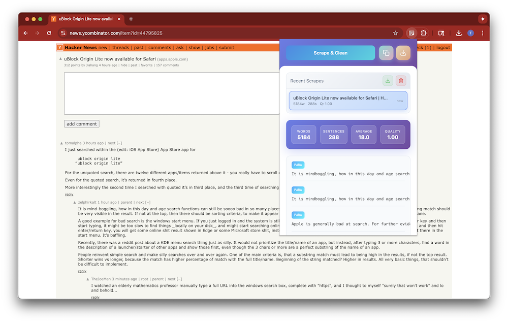

# Page Scraper - Scrape & Clean Any Page

Page Scraper filters out boilerplate content, navigation elements, and ads to deliver high-quality, structured text data. It aims to be a powerful Chrome extension that intelligently extracts and cleans web page content for analysis, machine learning, or research purposes. 



## ✨ Features

### 🧠 Intelligent Content Extraction
- **Smart Content Detection**: Automatically identifies and extracts main content while filtering out navigation, ads, and boilerplate text
- **Quality Scoring**: Evaluates content relevance and assigns quality scores to ensure you get the best text
- **Multi-format Support**: Extracts headings, paragraphs, and list items with proper hierarchical structure

### 📊 Content Analytics
- **Word Count**: Real-time word and sentence counting
- **Quality Metrics**: Content quality scoring based on relevance and structure
- **Reading Statistics**: Average sentence length and readability analysis

### 💾 Data Management
- **History Tracking**: Automatically saves up to 20 recently scraped pages
- **Persistent Storage**: Content survives browser restarts
- **Quick Access**: One-click access to previously scraped content

### 📤 Export Options
- **Copy to Clipboard**: Instant copying with formatted metadata
- **Single Download**: Export individual pages as text files
- **Bulk Export**: Download all history as a combined file with timestamps

### 🎨 User Experience
- **Progress Tracking**: Real-time scraping progress with animated indicators
- **Responsive Design**: Adaptive interface that expands when content is available
- **Visual Feedback**: Button states and animations for all actions

## 🚀 Installation

1. Download or clone this repository
2. Open Chrome and navigate to `chrome://extensions/`
3. Enable "Developer mode" in the top right
4. Click "Load unpacked" and select the extension folder
5. The Page Scraper icon will appear in your Chrome toolbar

## 📖 How to Use

1. **Navigate** to any webpage you want to scrape
2. **Click** the Page Scraper extension icon in your toolbar
3. **Press** the "Scrape & Clean" button
4. **View** the extracted content with quality metrics
5. **Export** using copy, download, or bulk download options

### Content Structure

The extension organizes content into three types:
- **Headings** (H1-H6): Marked with `#` prefix
- **Paragraphs**: Clean body text 
- **Lists**: Bulleted items marked with `•` prefix

## 🔧 Technical Details

### Content Filtering Algorithm
- Removes navigation elements, footers, and sidebars
- Filters out cookie notices and advertisement content
- Scores content blocks based on text density and semantic relevance
- Normalizes text formatting and removes special characters

### Data Format
```javascript
{
  url: "https://example.com",
  title: "Page Title",
  content: [
    { type: "heading", level: 1, text: "Main Heading" },
    { type: "paragraph", text: "Content paragraph..." },
    { type: "list-item", text: "List item content" }
  ],
  metadata: {
    wordCount: 1250,
    sentenceCount: 45,
    avgSentenceLength: 27.8,
    qualityScore: "1.00"
  }
}
```

### Permissions Required
- `activeTab`: Access current webpage content
- `scripting`: Inject content extraction scripts
- `storage`: Save scraped content history
- `<all_urls>`: Work on any website

## 🎯 Use Cases

- **Research**: Collect clean text data for academic research
- **Machine Learning**: Prepare training datasets from web content
- **Content Analysis**: Analyze text structure and quality metrics
- **Documentation**: Archive important webpage content
- **Data Science**: Gather structured text for analysis projects

## 📁 File Structure

```
clean-web/
├── manifest.json       # Extension configuration
├── popup.html         # Main interface
├── popup.js           # UI logic and data management
├── content.js         # Content extraction algorithm
├── background.js      # Service worker
├── icon.png          # Extension icon
└── ex.png            # Demo screenshot
```

## 🤝 Contributing

Contributions are welcome! Feel free to:
- Report bugs or request features
- Submit pull requests with improvements
- Share feedback on content extraction accuracy

## 📄 License

Feel free to use Page Scraper in any way you want.
